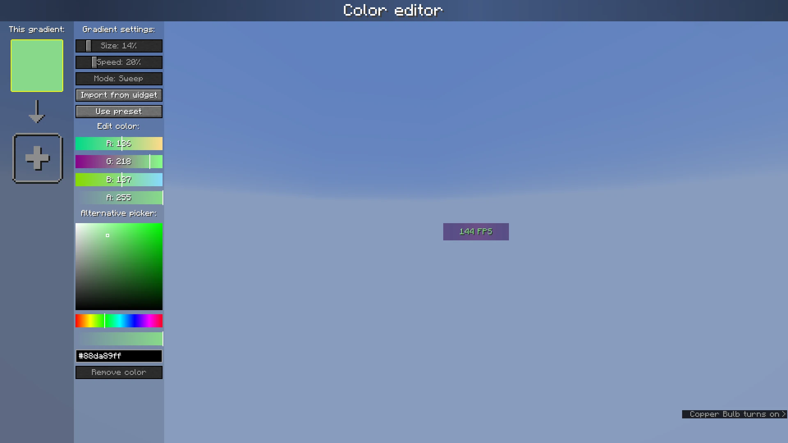

# Widgets
**Adds customizable in-game widgets to your game.**

This Minecraft mod adds customizable widgets that you may know from other Minecraft clients.

This mod was specifically made for people who just use Fabric or Quilt (and no specific client).
It also has some benefits over using clients:
1. Performance:
   - We've tried to optimize the mod as much as possible to make sure the game runs as smoothly as possible.
   - Disabled widgets don't use any performance
2. No additional features
   - The mod focuses on **widgets only**. It does not contain any other features such as performance improvements or mods.
3. Easy to use
   - We've tried to make the mod as easy to use as possible, for example, there are three ways to open the config menu instead of only a keybind.

## Widget settings
There are three ways to open the widget settings:
1. Press the key bind (bound to right shift by default)
2. Enter the command "/widgetsmod"
3. Open the config menu through [Mod Menu](https://modrinth.com/mod/modmenu)

Once you've opened the settings, you will see the widget overview menu:

You can now enable the widgets you want to enable, or click on them to view their additional settings, as you can see here:

When you're done with configuring which widgets you want to enable and their settings, click the "Edit Layout" button on the left:

This will take you to a screen where you can freely move around your enabled widgets.

Right-clicking on this screen will bring up a useful context menu with additional options, like enabling/disabling widgets or changing their settings.

When you're done, just press Escape until you return to the game.

Now, everything is done. Your widgets automatically save for the next time you play.

## Color editor

Newer mod versions (2.3.0+) include a **color editor** which provides full customization for your widgets' background and text colors:

The color list on the left shows the colors which are currently configured; if you add more than one, it becomes a gradient. Clicking on the colors will select them.

The settings bar on the right of the color list can be used to customize gradient settings, import from other widgets, or use presets.
Below that, the color which is currently selected can be changed or deleted.